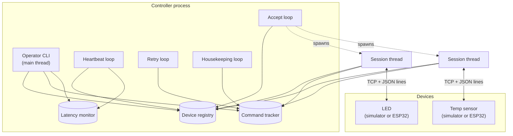
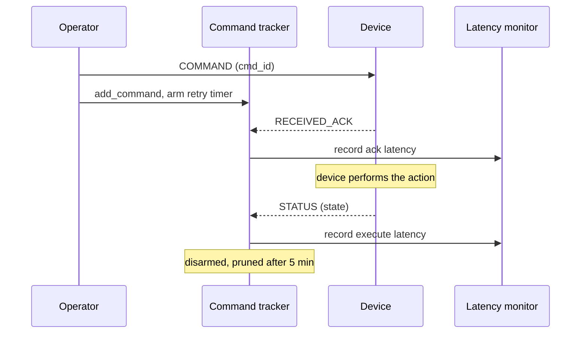

# Remote Device Control and Monitoring System

A controller for IoT-style devices over a custom JSON-line protocol on plain TCP.
Devices authenticate, receive commands, acknowledge them twice, push telemetry, and
answer heartbeats. The controller tracks who is connected, retries commands that go
unacknowledged, and measures how long every exchange took.

Ships with software simulators, so it all runs on one machine with no hardware.
ESP32 firmware speaking the same protocol is included for when you have some.

**Measured on loopback: 0.40 ms median command round trip, ~9,300 commands/sec,
100% delivery across 2,300 commands.**

## Quick start

Python 3.10+, no third-party runtime dependencies.

```bash
python -m venv .venv
source .venv/bin/activate          # Windows: .venv\Scripts\Activate.ps1
pip install -r requirements.txt    # pytest, for the tests
```

**Terminal 1** — the controller. Its operator prompt runs in this same window.

```bash
python -m controller.server.server
```

**Terminal 2** — a device, or two.

```bash
python -m simulations.simulated_led_device
python -m simulations.simulated_temp_device
```

Back in terminal 1:

```
controller> list
controller> send led1 TURN_ON
controller> latency
```

| Command | Does |
|---|---|
| `list` | Connected devices, liveness, last status |
| `status <id>` | One device in detail, with its latency profile |
| `send <id> <action> [--param k=v]` | Queue a command |
| `pending` | Delivery table: acked, executed, retries, latency |
| `stats` | Counters and success rate |
| `latency [--per-device] [--json]` | Latency distribution |
| `bench <id> <action> -n 200` | Fire N commands and report |

Actions: `TURN_ON` / `TURN_OFF` / `TOGGLE` on the LED, `READ_NOW` /
`SET_INTERVAL --param seconds=1` on the sensor.

## Screenshots

The controller starts, binds its listener, and drops you at the operator prompt.


`list` shows both devices — the sensor is already reporting, since it pushes telemetry on a timer without being asked.


One command end to end: sent, acknowledged in 0.3 ms, executed in 0.5 ms.


`status` gives one device in detail, including its own latency profile.


`pending` is the delivery table — what was acked, what executed, retries, and what each leg cost.


`stats` rolls it up into counters and a success rate.


<!-- Retake assets/screenshots/cli-latency.png (it captured the pre-fix heartbeat
     race), then add:   -->

## What it does

- **Auth** — a connection must present a valid token as its first message, or it is closed. Silent peers are dropped on a timeout.
- **Two-stage ack** — `RECEIVED_ACK` the instant a command lands, `STATUS` once it has actually run. Separates network cost from device work, and makes both measurable.
- **Retries** — unacknowledged commands are resent up to a limit, then marked failed. At-least-once delivery, so `TURN_ON` is safe to retry but `TOGGLE` is not.
- **Heartbeats** — every device is pinged on a timer; silent ones are flagged, dead sockets dropped.
- **Latency** — every ack, execution, and heartbeat round trip lands in a bounded ring buffer with full percentiles, queryable live.
- **Reconnection** — devices reconnect on their own; the controller needs no restart.

## Architecture

One controller process, one thread per connected device.



Four background loops plus the CLI thread and one session thread per device. All
mutable state lives in three modules — [`device_manager`](controller/server/device_manager.py),
[`command_tracker`](controller/server/command_tracker.py) and
[`latency_monitor`](controller/server/latency_monitor.py) — each guarding its dict
with its own mutex and handing out **copies**, so callers can iterate without
holding a lock or corrupting shared state.

The CLI runs inside the controller process because the registry holds live sockets,
which cannot cross a process boundary. `python -m controller.cli.cli` refuses to
start rather than show an empty device list. Thread-per-connection suits tens of
devices; thousands would want `asyncio`.

## Command lifecycle



If `RECEIVED_ACK` does not arrive in time the retry loop resends and restarts the
latency clock, so a retried command reports the latency of the attempt that
actually worked. After the retry limit it is marked failed.

## Protocol

Newline-delimited JSON over TCP. The newline is the frame delimiter, so readers
buffer until they see one — a single `recv()` may carry half a message or three.

```
{"msg_type":"COMMAND","cmd_id":"a1b2c3d4","device_id":"led1","action":"TURN_ON","params":{},"timestamp":1753412345.67}
```

| Type | Direction | Purpose |
|---|---|---|
| `AUTH` / `AUTH_OK` / `AUTH_FAIL` | handshake | Token check; must be the first message |
| `COMMAND` | controller → device | `cmd_id`, `action`, `params` |
| `RECEIVED_ACK` | device → controller | Sent on receipt, before acting |
| `STATUS` | device → controller | Sent after acting; without a `cmd_id` it is unsolicited telemetry |
| `HEARTBEAT` / `HEARTBEAT_ACK` | liveness | Ping every 10 s, RTT recorded |

`success: false` means the device understood but could not comply — a completed
exchange, so it is not retried.

The token is plaintext over an unencrypted socket and `device_id` is
self-asserted. LAN-only by design.

## Latency

Measured controller-side against `time.perf_counter()`, so no clock sync with the
device is needed. Three channels: `ack` (transport round trip), `execute` (round
trip + device work), `heartbeat` (idle path).

```bash
python scripts/latency_benchmark.py
```

It builds its own controller and devices, so nothing needs to be running. Raw
output of the run below: [latency.json](latency.json).

**Closed loop** — one command in flight at a time, so no queueing delay. This is
what a single operator action costs. 300/300 completed.

| Channel | n | min | mean | p50 | p95 | p99 | max |
|---|---:|---:|---:|---:|---:|---:|---:|
| `ack` | 300 | 0.095 | 0.269 | 0.238 | 0.501 | 0.617 | 0.942 |
| `execute` | 300 | 0.106 | 0.320 | 0.272 | 0.583 | 1.009 | 1.231 |

**Open loop** — pushed as fast as they go: 2000/2000 in 0.214 s = **9,338
commands/sec**, at a 32.9 ms median under saturation.

Milliseconds, Python 3.12.7 / Windows 11 / TCP loopback, 50 warm-up commands
discarded. The two phases are reported separately because quoting a saturated
open-loop number as "the latency" is the usual way to publish a misleading one.
Loopback isolates protocol overhead; a real network adds 1–30 ms on top.

## Testing

```bash
pytest                 # 60 tests, ~1s
pytest -m "not slow"   # unit only, no sockets
```

Covers the protocol and framing, registry and retry lifecycle, percentile maths,
and real-socket end-to-end runs (auth rejection, frames split across packets,
telemetry, disconnect). The end-to-end tests assert on invariants rather than
wall-clock thresholds, so they do not go flaky under load.

## Configuration

Environment variables, all optional — full list in [.env.example](.env.example).

| Variable | Default | |
|---|---|---|
| `IOT_HOST` | `127.0.0.1` | `0.0.0.0` to accept LAN devices |
| `IOT_PORT` | `9000` | |
| `IOT_AUTH_TOKEN` | `iot-secret-2026` | Must match device firmware |
| `IOT_HEARTBEAT_EVERY_SEC` | `10` | |
| `IOT_COMMAND_MAX_RETRIES` | `3` | |

PowerShell has no inline `VAR=value command` form — set `$env:IOT_PORT='9500'`
first, and remember it persists for the rest of that window.

## Project layout

```
controller/protocol/   message builders, encode/decode, framing  (no I/O)
controller/config/     environment-backed settings
controller/server/     listener, registry, tracker, latency, logging
controller/cli/        operator REPL
simulations/           software devices (base + LED + temp sensor)
devices/               ESP32 firmware (needs WiFi.h and ArduinoJson)
scripts/               launchers and the benchmark
tests/                 unit and end-to-end suites
```

Dependencies point downward only, which is what lets tests and simulators use the
protocol layer without starting a listener. The controller cannot tell real
hardware from a simulator — same protocol, same registry, same CLI.

## Known limitations

- Thread per connection — fine for tens of devices, not thousands.
- In-memory only; restarting loses command history and latency samples.
- At-least-once delivery, so `TOGGLE` is not idempotent under retry.
- No transport security: plaintext token, no TLS, no replay protection.

## License

[MIT](LICENSE).
