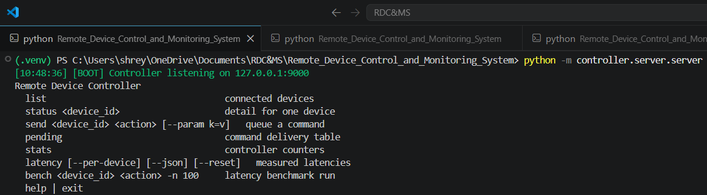
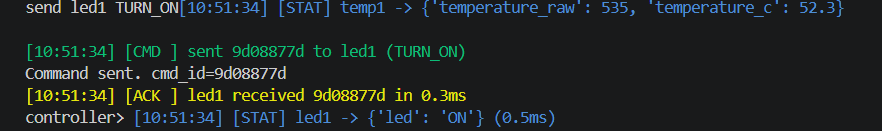
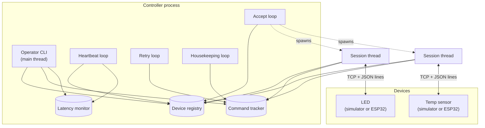
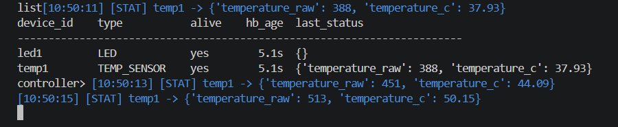
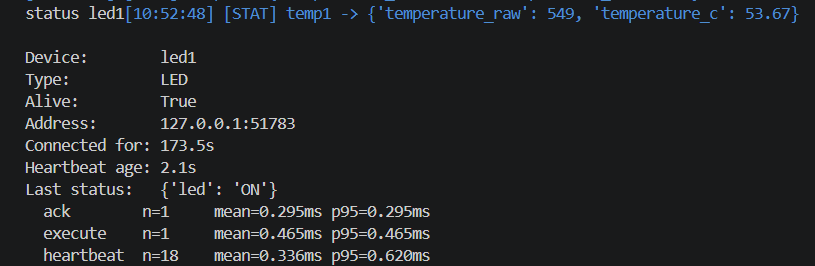
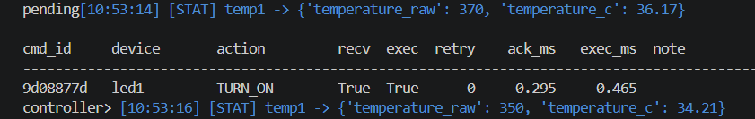
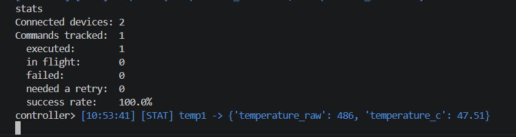
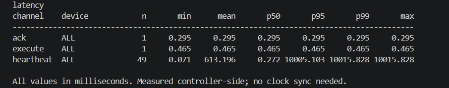

# Remote Device Control and Monitoring System

A controller for IoT-style devices over a custom JSON-line protocol on plain
TCP. Devices authenticate, receive commands, acknowledge them twice, report
telemetry, and answer heartbeats. The controller tracks who is connected,
retries commands that go unacknowledged, and measures how long every exchange
took.

Ships with software simulators, so the whole thing runs on one machine with
no hardware. ESP32 firmware speaking the same protocol is included for when
you have some.

```
                          ┌─────────────────────────┐
  ┌──────────┐            │  Controller             │
  │  LED     │◄──TCP─────►│   registry · retries    │
  └──────────┘  JSON      │   heartbeats · latency  │
  ┌──────────┐  lines     │   operator CLI          │
  │  Sensor  │◄──────────►│                         │
  └──────────┘            └─────────────────────────┘
```

**Measured on loopback: 0.40 ms median command round trip, ~9,300 commands/sec,
100% delivery over 2,300 commands.** Reproduce with one command —
see [Latency](#latency).



One command, end to end — sent, acknowledged in 0.3 ms, executed in 0.5 ms:



---

## Contents

- [Quick start](#quick-start)
- [What it does](#what-it-does)
- [Operator CLI](#operator-cli)
- [Architecture](#architecture)
- [Protocol](#protocol)
- [Latency](#latency)
- [Demo walkthrough](#demo-walkthrough)
- [Testing](#testing)
- [Configuration](#configuration)
- [Hardware](#hardware)
- [Project layout](#project-layout)
- [Known limitations](#known-limitations)

---

## Quick start

Python 3.10+. No third-party runtime dependencies.

```bash
git clone <your-repo-url>
cd Remote_Device_Control_and_Monitoring_System

python -m venv .venv
source .venv/bin/activate          # Windows: .venv\Scripts\Activate.ps1

pip install -r requirements.txt    # pytest, for the test suite
```

Then, in **terminal 1**, start the controller:

```bash
python -m controller.server.server
```

```
[09:41:02] [BOOT] Controller listening on 127.0.0.1:9000
Remote Device Controller
  list                                  connected devices
  status <device_id>                    detail for one device
  send <device_id> <action> [--param k=v]   queue a command
  ...
controller>
```

In **terminal 2**, start a device:

```bash
python -m simulations.simulated_led_device
```

Back in terminal 1, drive it:

```
controller> list
controller> send led1 TURN_ON
controller> latency
```

That is the whole loop. The [demo walkthrough](#demo-walkthrough) below covers
retries, auth failures, and reconnection.

### Convenience scripts

| | macOS / Linux | Windows |
|---|---|---|
| Controller | `bash scripts/run_server.sh` | `.\scripts\run_server.ps1` |
| Both devices | `bash scripts/run_devices.sh` | `.\scripts\run_devices.ps1` |

> The operator CLI runs **inside** the controller process, because the device
> registry holds live sockets that cannot cross a process boundary. There is
> no separate CLI to launch — `python -m controller.cli.cli` deliberately
> refuses to start rather than show you an empty device list. See
> [why the CLI is not a separate program](#why-the-cli-is-not-a-separate-program).

---

## What it does

**Authentication.** A connection must present a valid shared token as its
first message or the socket is closed. A peer that connects and says nothing
is dropped after a timeout.

**Device registry.** Live sockets plus type, address, liveness, and last
reported state. Thread-safe, and hands out copies so callers cannot corrupt
it.

**Two-stage acknowledgement.** Devices send `RECEIVED_ACK` the moment a
command arrives, then `STATUS` once it has actually been carried out.
Splitting them separates network cost from device work — and makes both
measurable.

**Retry with backpressure.** Unacknowledged commands are resent up to a
configurable limit, then marked failed. Delivery is at-least-once; see
[delivery guarantees](#delivery-guarantees).

**Heartbeats.** The controller pings every device on a timer, flags the
silent ones, and records the round trip.

**Telemetry.** The temperature sensor pushes unsolicited readings on a timer,
independent of any command.

**Latency instrumentation.** Every ack, execution, and heartbeat round trip
is recorded into a bounded ring buffer with min/mean/p50/p95/p99/max, queryable
live from the CLI.

**Reconnection.** Devices reconnect on their own; the controller needs no
restart.

---

## Operator CLI

| Command | Purpose |
|---|---|
| `list` | Connected devices, liveness, last status |
| `status <id>` | One device in detail, with its latency profile |
| `send <id> <action> [--param k=v]` | Queue a command |
| `pending` | Delivery table: acked, executed, retries, per-command latency |
| `stats` | Counters and success rate |
| `latency [--per-device] [--json] [--reset]` | Latency distribution |
| `bench <id> <action> -n 200` | Fire N commands and report the result |
| `help`, `exit` | |

Parameter values are typed automatically: `seconds=1` → int, `seconds=1.5` →
float, `on=true` → bool, anything else → string.

### Supported actions

| Device | Action | Parameters |
|---|---|---|
| LED | `TURN_ON`, `TURN_OFF`, `TOGGLE` | — |
| Temp sensor | `READ_NOW` | — |
| Temp sensor | `SET_INTERVAL` | `seconds` (float, min 0.5) |

An unknown action comes back as `success: false` rather than a timeout, so it
is not retried.

---

## Architecture

One controller process, many device connections, one thread per device.



### Threads

| Thread | Count | Job |
|---|---|---|
| Operator CLI | 1 (main) | Reads commands, prints tables |
| Accept | 1 | `accept()`, spawns a session thread per connection |
| Session | 1 per device | Reads frames, updates registry and tracker |
| Heartbeat | 1 | Pings every device, flags silent ones, records RTT |
| Retry | 1 | Resends unacknowledged commands, fails exhausted ones |
| Housekeeping | 1 | Prunes completed commands |

Thread-per-connection suits tens of devices, which is the target. Thousands
would want `asyncio` or `selectors` instead.

### Shared state

Three modules hold all mutable state. Each guards a dict with its own
`threading.Lock` and hands out **copies**, so a caller iterating results can
never trip over a concurrent mutation or corrupt the registry by editing what
it was given.

| Module | Holds | Bounded by |
|---|---|---|
| [`device_manager`](controller/server/device_manager.py) | Live sockets and per-device metadata | Number of connected devices |
| [`command_tracker`](controller/server/command_tracker.py) | In-flight and recently finished commands | Retention window + `MAX_TRACKED` |
| [`latency_monitor`](controller/server/latency_monitor.py) | Latency samples per channel per device | `MAX_SAMPLES` ring buffer |

Everything is in-memory and process-local. Restarting the controller loses
history, and devices reconnect on their own.

### Why the CLI is not a separate program

The registry holds live socket objects, which cannot cross a process
boundary. A standalone CLI process would have its own empty registry and
would cheerfully report zero devices. So the CLI runs on the main thread of
the controller process, and `python -m controller.cli.cli` refuses to start
rather than print a convincing lie.

Splitting them would mean a real control channel — a second listener speaking
an admin protocol, or an HTTP API over the same state.

### Layering

```
controller/
  protocol/    message construction and framing   (no I/O, no state)
  config/      environment-backed settings        (no dependencies)
  server/      sockets, registry, tracking, latency
  cli/         operator interface
simulations/   software devices that speak the protocol
devices/       Arduino/ESP32 firmware, same protocol
```

Dependencies point downward only: `protocol` and `config` know nothing about
`server`, which is what lets the simulators and the tests import the protocol
layer without dragging in a listener.

### Command lifecycle

```mermaid
sequenceDiagram
    participant Op as Operator
    participant T as Command tracker
    participant D as Device
    participant L as Latency monitor

    Op->>D: COMMAND (cmd_id)
    Op->>T: add_command, arm retry timer
    D-->>T: RECEIVED_ACK
    T->>L: record ack latency
    Note over D: device performs the action
    D-->>T: STATUS (state)
    T->>L: record execute latency
    Note over T: disarmed; pruned after 5 min
```

If `RECEIVED_ACK` does not arrive within `IOT_COMMAND_ACK_TIMEOUT_SEC`, the
retry loop resends and restarts the latency clock, so a retried command
reports the latency of the attempt that actually worked. After
`IOT_COMMAND_MAX_RETRIES` the command is marked failed. Delivery is
at-least-once — see [delivery guarantees](#delivery-guarantees).

### Failure handling

| Failure | Detected by | Result |
|---|---|---|
| Device stops answering pings | Heartbeat loop | Flagged `alive: false`, kept in registry |
| Socket send fails | Heartbeat loop | Removed from registry immediately |
| Device disconnects | Session thread read returns empty | Removed, its commands fail on next retry |
| Device reconnects mid-teardown | `unregister(device_id, conn)` identity check | Old thread cannot evict the new socket |
| Malformed JSON | Session thread | Frame logged and skipped, session survives |
| Unauthenticated peer | Session thread | `AUTH_FAIL`, socket closed |
| Peer connects and says nothing | Socket timeout | Dropped after `IOT_AUTH_TIMEOUT_SEC` |

---

## Protocol

A minimal request/response protocol over plain TCP. Every message is a single
JSON object on one line, terminated by `\n`.

```
{"msg_type":"COMMAND","cmd_id":"a1b2c3d4","device_id":"led1","action":"TURN_ON","params":{},"timestamp":1753412345.67}\n
```

### Framing

TCP is a byte stream with no message boundaries, so the newline is the frame
delimiter. Both sides buffer incoming bytes and only parse once a `\n` is
seen. A single `recv()` may return half a message, or three and a half
messages — the reader must handle both. `json.dumps` never emits a raw
newline inside a string, so the delimiter is unambiguous.

Reference implementations: `_recv_lines()` in
[connection_handler.py](controller/server/connection_handler.py) and
`_listen_loop()` in [base.py](simulations/base.py).

### Common fields

| Field | Type | Present on | Meaning |
|---|---|---|---|
| `msg_type` | string | all | Message category, see below |
| `timestamp` | float | all | Unix time at the sender |
| `device_id` | string | most | Device this message concerns |
| `cmd_id` | string | command flow | 8 hex chars, correlates a command with its replies |

### Message types

All type strings live in
[constants.py](controller/protocol/constants.py); all builders live in
[message_format.py](controller/protocol/message_format.py).

#### Handshake

| Type | Direction | Fields |
|---|---|---|
| `AUTH` | device → controller | `device_id`, `device_type`, `token` |
| `AUTH_OK` | controller → device | `device_id` |
| `AUTH_FAIL` | controller → device | `reason` |

A connection must send `AUTH` as its very first message. Anything else is
answered with `AUTH_FAIL` and the socket is closed. A connection that sends
nothing at all is dropped after `IOT_AUTH_TIMEOUT_SEC`, so an idle peer
cannot pin a thread open indefinitely.

The token is a shared secret from `IOT_AUTH_TOKEN`. It is compared in
plaintext over an unencrypted socket — see [Security](#security).

#### Command flow

| Type | Direction | Fields |
|---|---|---|
| `COMMAND` | controller → device | `cmd_id`, `device_id`, `action`, `params` |
| `RECEIVED_ACK` | device → controller | `cmd_id`, `device_id` |
| `STATUS` | device → controller | `device_id`, `state`, `success`, optional `cmd_id`, optional `message` |

Two acknowledgements, deliberately:

- `RECEIVED_ACK` is sent **immediately** on receipt, before the device acts.
- `STATUS` is sent **after** the action completes, carrying the new state.

Splitting them separates transport cost from device work. `RECEIVED_ACK`
alone tells you the network round trip; the gap between the two tells you how
long the device took. Both are measured — see [Latency](#latency).

A `STATUS` without a `cmd_id` is unsolicited telemetry, not a command reply.
The temperature sensor pushes these on a timer.

`success: false` means the device understood the message but could not carry
out the action (unknown `action`, bad parameter). It is a completed exchange,
not a delivery failure, so the controller does **not** retry it.

#### Liveness

| Type | Direction | Fields |
|---|---|---|
| `HEARTBEAT` | controller → device | `source` |
| `HEARTBEAT_ACK` | device → controller | `device_id` |

The controller pings every device every `IOT_HEARTBEAT_EVERY_SEC`. A device
that has not answered within an additional `IOT_HEARTBEAT_TIMEOUT_SEC` is
flagged `alive: false` but kept in the registry, since the socket may still
recover. It is removed only when the socket actually fails.

### Delivery guarantees

Delivery is **at-least-once**, not exactly-once.

An unacknowledged `COMMAND` is resent every `IOT_COMMAND_RETRY_INTERVAL_SEC`
up to `IOT_COMMAND_MAX_RETRIES` times, then marked failed. Because a retry
may duplicate a command whose original `RECEIVED_ACK` was merely slow, a
device can legitimately see the same `cmd_id` twice.

Actions that are naturally idempotent (`TURN_ON`, `TURN_OFF`) are safe under
this model. `TOGGLE` is **not** — a duplicate flips the LED an extra time.
Firmware that cares should keep a short set of recently-seen `cmd_id`s and
re-send the previous `STATUS` instead of re-running the action.

### Full exchange

```
device                          controller
  |-- AUTH ---------------------->|   token checked
  |<-- AUTH_OK ------------------ |   device enters registry
  |                               |
  |<-- COMMAND (cmd_id=a1b2) -----|   tracked, retry timer armed
  |-- RECEIVED_ACK (a1b2) ------->|   ack latency recorded
  |     ... device does the work  |
  |-- STATUS (a1b2, state) ------>|   execute latency recorded, retry disarmed
  |                               |
  |<-- HEARTBEAT -----------------|   every 10s
  |-- HEARTBEAT_ACK ------------->|   heartbeat RTT recorded
  |                               |
  |-- STATUS (no cmd_id) -------->|   unsolicited telemetry
```

### Security

The threat model here is a coursework LAN, not the open internet:

- The token is sent in plaintext and compared with `!=`, which is not
  constant-time.
- There is no transport encryption, so traffic can be read and modified.
- There is no replay protection; a captured `AUTH` frame can be replayed.
- `device_id` is self-asserted, so any holder of the token can impersonate
  any device.

Do not expose the port to an untrusted network. Making this production-grade
means TLS, per-device credentials, and a constant-time comparison.

---

## Latency

Latency is measured controller-side against `time.perf_counter()`, so no
clock synchronisation with the device is needed. Three channels are tracked:

| Channel | Measures |
|---|---|
| `ack` | `COMMAND` → `RECEIVED_ACK` — transport round trip |
| `execute` | `COMMAND` → `STATUS` — round trip plus device work |
| `heartbeat` | `HEARTBEAT` → `HEARTBEAT_ACK` — idle path |

### Reproduce

```bash
python scripts/latency_benchmark.py
```

It builds its own controller and devices, so nothing needs to be running.
Options: `--devices N`, `--samples N`, `--throughput-commands N`,
`--markdown out.md`, `--json out.json`.

To refresh the committed numbers below, re-run the exact configuration they
came from and paste the new tables in:

```bash
python scripts/latency_benchmark.py --devices 2 --samples 300 --throughput-commands 2000 --json latency.json
```

Absolute figures vary by machine and load — expect a spread of roughly 2×
between runs on the same box. The ratio between the two phases is the stable,
meaningful part.

### Method

Two phases are measured separately, because conflating them is the most
common way to publish a misleading latency number:

1. **Latency (closed loop)** — one command in flight at a time. Each send
   waits for its own `STATUS` before the next goes out, so the samples
   contain no queueing delay.
2. **Throughput (open loop)** — commands pushed as fast as they will go. This
   saturates the pipe on purpose, so its latencies include queueing and are
   reported separately as "under load".

The first 50 commands are discarded as warm-up: they pay for lazy imports,
TCP slow start and cold caches, which would otherwise distort the tail
percentiles.

### Results

Python 3.12.7, Windows 11 (AMD64), TCP loopback, 2 simulated devices, 50
warm-up commands discarded. Generated `2026-07-25 05:05:36Z`. Raw output:
[latency.json](latency.json).

**Phase 1 — latency, closed loop.** One command in flight at a time, so the
samples contain no queueing delay. This is what a single operator action
costs. 300/300 completed in 0.773 s.

| Channel | n | min | mean | p50 | p95 | p99 | max |
|---|---:|---:|---:|---:|---:|---:|---:|
| `ack` | 300 | 0.140 | 0.350 | 0.316 | 0.709 | 1.022 | 1.364 |
| `execute` | 300 | 0.155 | 0.443 | 0.395 | 0.940 | 1.180 | 1.559 |

**Phase 2 — throughput, open loop.** Commands pushed as fast as they will go.
2000/2000 completed in 0.214 s = **9,338 commands/sec**.

| Channel | n | min | mean | p50 | p95 | p99 | max |
|---|---:|---:|---:|---:|---:|---:|---:|
| `ack` | 2000 | 0.330 | 10.298 | 10.558 | 19.276 | 20.866 | 21.627 |
| `execute` | 2000 | 0.501 | 10.413 | 10.674 | 19.377 | 20.948 | 21.687 |

All values in milliseconds.

The two phases are reported separately on purpose. Phase 2's latencies are
~27× phase 1's because the pipe is saturated and commands queue — that is a
measure of behaviour under overload, not of how long a command takes. Quoting
a saturated open-loop number as "the latency" is the most common way to
publish a misleading one.

### Caveats

- Measured over TCP loopback, so these figures isolate protocol and
  controller overhead. A real deployment adds physical network time
  (typically 1–30 ms on LAN/Wi-Fi) on top.
- The devices are Python simulators. Real firmware adds its own processing
  time, which shows up in `execute` but not in `ack`.
- Timed with `time.perf_counter()` on the controller only, so no clock
  synchronisation between controller and device is required.

---

## Demo walkthrough

A scripted run that exercises every feature, in the order that makes the best
screenshots. Takes about five minutes.

You need two terminals (three if you want each device in its own window).

### Terminal 1 — controller

```bash
python -m controller.server.server
```

```
[09:41:02] [BOOT] Controller listening on 127.0.0.1:9000
Remote Device Controller
  list                                  connected devices
  ...
controller>
```

Leave this running. Every command below is typed at this `controller>` prompt.

### Terminal 2 — devices

```bash
python -m simulations.simulated_led_device
python -m simulations.simulated_temp_device    # ideally a third terminal
```

Each prints `[led1] authenticated`, and terminal 1 logs the connection:

```
[09:41:15] [AUTH] led1 (LED) connected from 127.0.0.1:53914
[09:41:18] [AUTH] temp1 (TEMP_SENSOR) connected from 127.0.0.1:53915
```

### 1. See what is connected

```
controller> list
```



`temp1` already shows a reading — it pushes telemetry on a timer without
being asked. Those `[STAT]` lines interleaved with the prompt are that
telemetry arriving while you type; the controller logs and the prompt share
one terminal.

### 2. Control the LED

```
controller> send led1 TURN_ON
```


Three log lines for one command: sent, acknowledged, executed. The two
timings are the two things the latency monitor tracks — `0.3ms` is the
transport round trip, `0.5ms` includes the device doing the work.

The LED terminal shows `[led1] LED -> ON`.

Try `send led1 TOGGLE` and `send led1 TURN_OFF` too.

### 3. Send a command with parameters

```
controller> send temp1 SET_INTERVAL --param seconds=1
```

Readings in terminal 1 speed up to one per second. Values are typed
automatically — `seconds=1` arrives as an integer, `seconds=1.5` as a float,
`on=true` as a boolean.

### 4. Inspect one device

```
controller> status led1
```



The three latency lines at the bottom are this device's own profile, not the
controller-wide totals.

### 5. Watch delivery bookkeeping

```
controller> pending
```



Every command that has been sent, whether it was acknowledged and executed,
how many retries it needed, and what each leg cost. `note` carries the reason
when something failed.

```
controller> stats
```



### 6. Latency

```
controller> latency
```

```
channel    device              n       min      mean       p50       p95       p99       max
----------------------------------------------------------------------------------------------
ack        ALL                 3     0.398     0.421     0.412     0.455     0.455     0.455
execute    ALL                 3     0.487     0.532     0.508     0.601     0.601     0.601
heartbeat  ALL                18     0.211     0.334     0.312     0.502     0.611     0.611

All values in milliseconds. Measured controller-side; no clock sync needed.
```

<!-- Retake assets/screenshots/cli-latency.png after the heartbeat race fix,
     then add:   -->

Add `--per-device` to break it down per device, or `--json` for machine
output. All three channels should sit in the same sub-millisecond range on
loopback; a `heartbeat` max near 10 000 ms means a stale checkout from before
the heartbeat timer was armed ahead of its send.

### 7. Benchmark from the prompt

```
controller> bench led1 TOGGLE -n 200
```

Fires 200 commands and prints throughput plus the resulting distribution.

### 8. Show the retry path

Kill the LED simulator (Ctrl+C) and immediately send it a command:

```
controller> send led1 TURN_ON
```

```
[09:45:10] [DISC] led1 disconnected
[09:45:13] [CMD ] led1 is not connected.
```

Or, to catch a real retry, send a command and kill the device within the
5-second ack window:

```
[09:45:20] [CMD ] retry 1/3 of d4e5f6a7 to led1
[09:45:25] [CMD ] d4e5f6a7 failed: device disconnected
```

Restart the simulator and it reconnects on its own — no controller restart:

```
[09:45:40] [AUTH] led1 (LED) connected from 127.0.0.1:53980
```

### 9. Reject a bad token

Shows authentication actually working. Start a device with a token the
controller will not accept:

```bash
# macOS / Linux
IOT_AUTH_TOKEN=wrong-token python -m simulations.simulated_led_device
```

```powershell
# Windows PowerShell - no inline VAR=value form, so set it, run, then clear it
$env:IOT_AUTH_TOKEN='wrong-token'; python -m simulations.simulated_led_device; $env:IOT_AUTH_TOKEN=$null
```

```
[led1] connecting to 127.0.0.1:9000 ...
[led1] authentication rejected: Invalid token
```

> Clearing the variable afterwards matters on PowerShell: `$env:` assignments
> persist for the rest of the session, so if you leave it set and then restart
> the **controller** in the same window, both sides get `wrong-token`, they
> match, and authentication quietly succeeds — which looks like the check is
> broken when it is not.

Controller side:

```
[09:46:02] [AUTH] rejected 127.0.0.1:54001 - Invalid token
```

The device exits instead of retrying forever with credentials it now knows
are bad.

### 10. Shut down

```
controller> exit
```

---

## Testing

```bash
pytest                    # everything, ~1s
pytest -m "not slow"      # unit tests only, no sockets
pytest -v                 # per-test names
```

57 tests across four files:

| File | Covers |
|---|---|
| [test_protocol.py](tests/test_protocol.py) | Message construction, encoding, framing, unicode, ID uniqueness |
| [test_server.py](tests/test_server.py) | Registry, command lifecycle, retries, pruning, reconnect races |
| [test_latency.py](tests/test_latency.py) | Percentile maths, duplicate-ack rejection, buffer bounds, end-to-end measurement |
| [test_end_to_end.py](tests/test_end_to_end.py) | Real sockets: auth, split frames, round trips, telemetry, disconnect |

The end-to-end tests open real TCP connections on OS-assigned ports and
assert on invariants rather than wall-clock thresholds, so they do not turn
flaky on a loaded machine.

---

## Configuration

Every setting is an environment variable; see [.env.example](.env.example).

| Variable | Default | Meaning |
|---|---|---|
| `IOT_HOST` | `127.0.0.1` | Bind address. `0.0.0.0` to accept LAN devices |
| `IOT_PORT` | `9000` | Listen port |
| `IOT_AUTH_TOKEN` | `iot-secret-2026` | Shared secret |
| `IOT_AUTH_TIMEOUT_SEC` | `5` | Deadline for an unauthenticated peer |
| `IOT_HEARTBEAT_EVERY_SEC` | `10` | Ping interval |
| `IOT_HEARTBEAT_TIMEOUT_SEC` | `5` | Extra grace before flagging a device |
| `IOT_COMMAND_ACK_TIMEOUT_SEC` | `5` | Wait before resending a command |
| `IOT_COMMAND_MAX_RETRIES` | `3` | Attempts before giving up |
| `IOT_COMMAND_RETRY_INTERVAL_SEC` | `3` | Retry loop tick |
| `IOT_NO_COLOR` | unset | Set to `1` to drop ANSI colour |

```bash
# macOS / Linux - prefix applies to this command only
IOT_PORT=9500 IOT_HEARTBEAT_EVERY_SEC=2 python -m controller.server.server
```

```powershell
# Windows PowerShell - assignments persist for the session
$env:IOT_PORT='9500'; $env:IOT_HEARTBEAT_EVERY_SEC='2'
python -m controller.server.server
```

PowerShell has no inline `VAR=value command` form. Set `$env:NAME` first, and
remember it stays set for the rest of that window — clear one with
`$env:NAME=$null`, or just open a new terminal. Devices read the same
variables, so any terminal running a simulator needs `IOT_PORT` set to match
the controller.

---

## Hardware

[devices/](devices/) holds ESP32 sketches speaking the same protocol —
`led_device` and `temp_device`. Each needs `WiFi.h` and `ArduinoJson`.

Before flashing, set your SSID, password, server IP, and token at the top of
the `.ino`, and set `IOT_HOST=0.0.0.0` on the controller so it accepts
connections from the LAN. The controller cannot tell real hardware from a
simulator — same protocol, same registry, same CLI.

The token is sent in plaintext over an unencrypted socket, and `device_id`
is self-asserted. This is a LAN-only design. See [Security](#security).

---

## Project layout

```
controller/
  protocol/    message builders, encode/decode, framing   (no I/O)
  config/      environment-backed settings
  server/      listener, registry, command tracker, latency, logging
  cli/         operator REPL
simulations/   software devices (base class + LED + temp sensor)
devices/       ESP32 firmware
scripts/       launchers and the benchmark
tests/         unit and end-to-end suites
assets/        screenshots
latency.json   raw output of the committed benchmark run
```

Dependencies point downward only — `protocol` and `config` know nothing about
`server`, which is what lets tests and simulators use the protocol layer
without starting a listener.

---

## Known limitations

- **Thread per connection.** Fine for tens of devices; thousands would want
  `asyncio`.
- **In-memory only.** Restarting the controller loses command history and
  latency samples. Devices reconnect on their own.
- **At-least-once delivery.** `TOGGLE` is not idempotent under retry — see
  [delivery guarantees](#delivery-guarantees).
- **No transport security.** Plaintext token, no TLS, no replay protection.

## License

[MIT](LICENSE).
